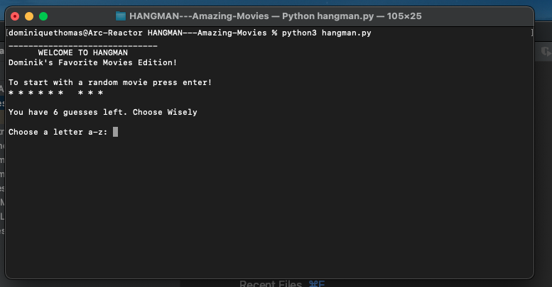
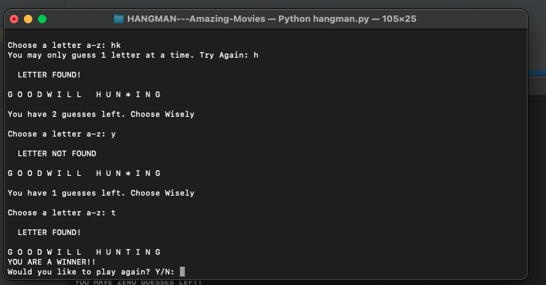
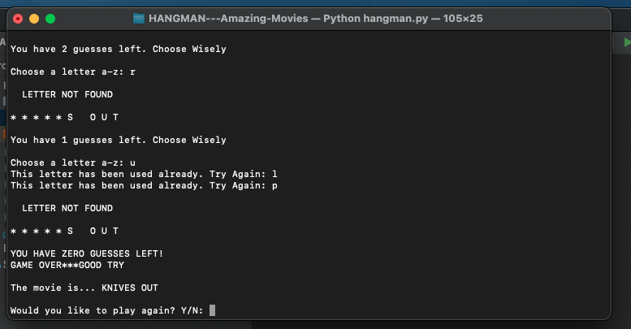

# HANGMAN MOVIES EDITION
A simple hangman game played inside the command line or terminal

## 1st Solo Project
* This beginner project was started to develop and practice my coding skills with the python language. 

## O.O.P.
* To better understand Object Oriented Programming I changed the code structure to incorporate classes instead of a script full of functions.

## Screenshots
* Welcome Screen

* Winner Screen

* Game Over Screen

## How to play
- Clone repository
- open terminal
- navigate to /HANGMAN---AMAZING-MOVIES
- enter python3 hangman.py
